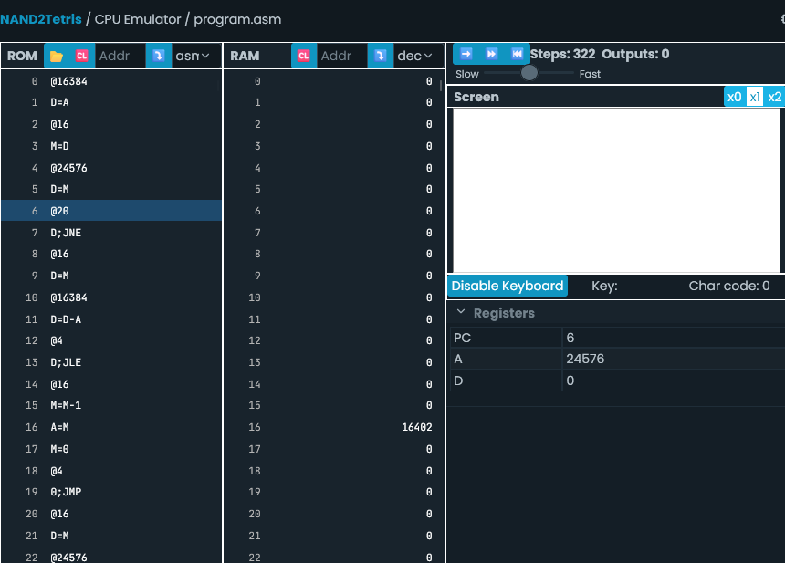
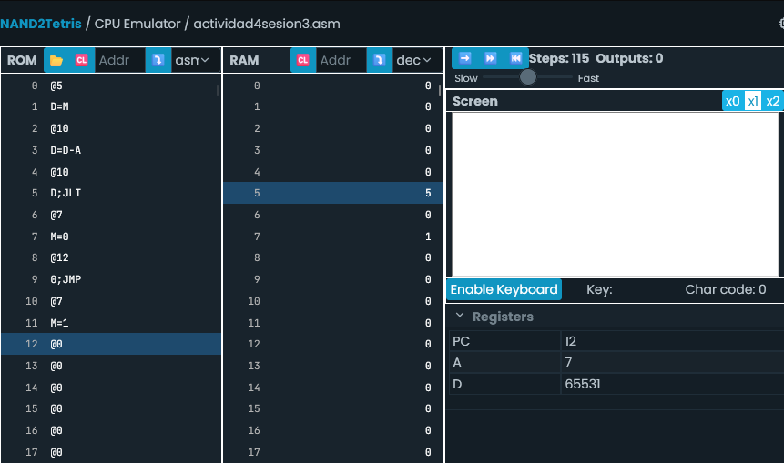

## Actividad 3

- La ALU (Arithmetic Logic Unit) hace parte de la CPU y realiza operaciones aritméticas y lógicas.  En este caso, la ALU recibe la condición de que si se detecta una tecla presionada en el teclado, debe de indicar a los espacios de memoria que manejan la pantalla (@SCREEN) que creen una línea negra de 16 píxeles por cada iteración en el loop mientras se mantenga la tecla oprimida. En caso contrario, se van eliminando estas líneas de forma regresiva mientras no se esté presionando una tecla.
- El registro PC sirve para ir por cada una de las instrucciones de memoria almacenadas en la ROM de forma consecutiva de acuerdo a las instrucciones que vaya leyendo.
- @i: Asigna un espacio de memoria en la RAM para esta variable en la posición más baja disponible desde la posición 16.
  @READKEYBOARD: Apunta a la dirección de memoria 24576 para leer cualquier input de teclado, y se registran estos inputs por códigos numéricos asignados a cada tecla.
- Se debe apuntar a @READKEYBOARD para leer los inputs de teclado y se debe apuntar a las posiciones 16384 (@SCREEN) hasta la 24575 para modificar píxeles de la pantalla que se usa en el simulador.
- El bucle dentro de READKEYBOARD va borrando las líneas creadas en la pantalla si no detecta input del teclado.
- La primera condición de las líneas 7 a 10 verifica que si se está presionando una tecla, el programa salta a la dirección de la etiqueta KEYPRESSED para crear una línea en la dirección de pantalla actual dentro del bucle.

----------------------------------------------------------------------------------------------------------------
## Actividad 4

Inicialmente, el código hack no funcionaba debido a que no agregué la línea '0;JMP' para realizar el salto de END en caso de que no se cumpliera la condición. Después de agregarlo si hace el salto correctamente al final del código cuando M en RAM[5] es mayor que 10.

### VARIABLES
- Los primeros 15 registros en la memoria RAM son variables predefinidas
(RAM[0]-RAM[15]) . Del 16 en adelante se usan para asignar VARIABLES

### ETIQUETAS
- La posición en la memoria ROM de cada etiqueta con sus instrucciones está dada
por su posición de PC asignado por el ensamblador. 

