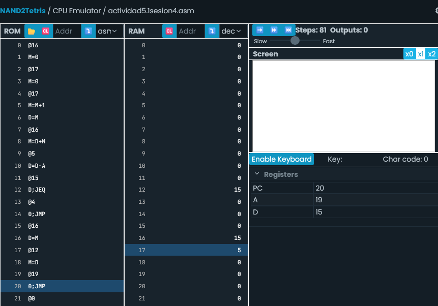
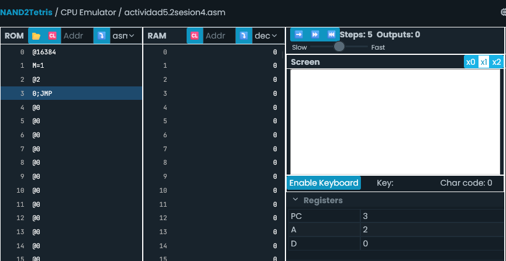
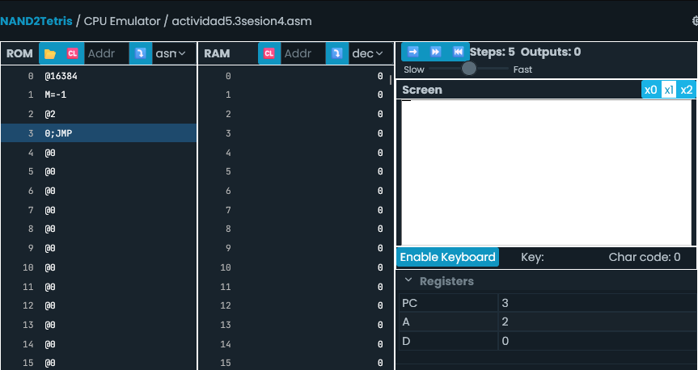
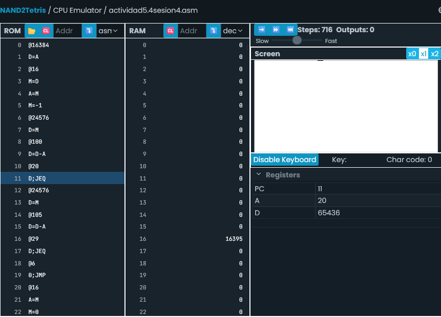

- RAM[0] a RAM[16383] --> Uso libre de procesamiento
  RAM[16384] a RAM[24575] --> Pantalla
  RAM[24576] --> Teclado

  Cada registro está compuesto de 16 bits binarios
    0 = blanco
    1 = negro
    -1 = Asigna 1 (negro) a todos los bits

MD --> Asigna y copia dato
----------------------------------------------------------------------------------------------------------------
Actividad 5.1

- AL inicio no sabía cómo hacer que se sume del 1 al 5 sin que se borrara la memoria de resultado anterior hasta llegar al 5. La solución fue asignar a la variable i cada número sucesivo para luego sumarlo a la variable 'suma' que va almacenando cada resultado. Cuando i llega a 5 se sale del loop para luego almacenar el resultado final a RAM[12].

Actividad 5.2

- Apunto a SCREEN donde está ubicado el primer bit (pixel) del mapa de la pantalla y le asigno 1 para que se vuelva negro.

Actividad 5.3

- Para asignar 1 a los 16 bits de la esquina izquierda de la pantalla le asigno a esa posición -1 para que asigne 1 a cada bit.

Actividad 5.4

- Para hacer que la línea se mueva a la derecha e izquierda, se implementaron condiciones usando etiquetas que van borrando la línea en la posición actual del contador para moverla en la dirección correspondiente si se está presionando 'd' (derecha) o 'i' (izquierda).

