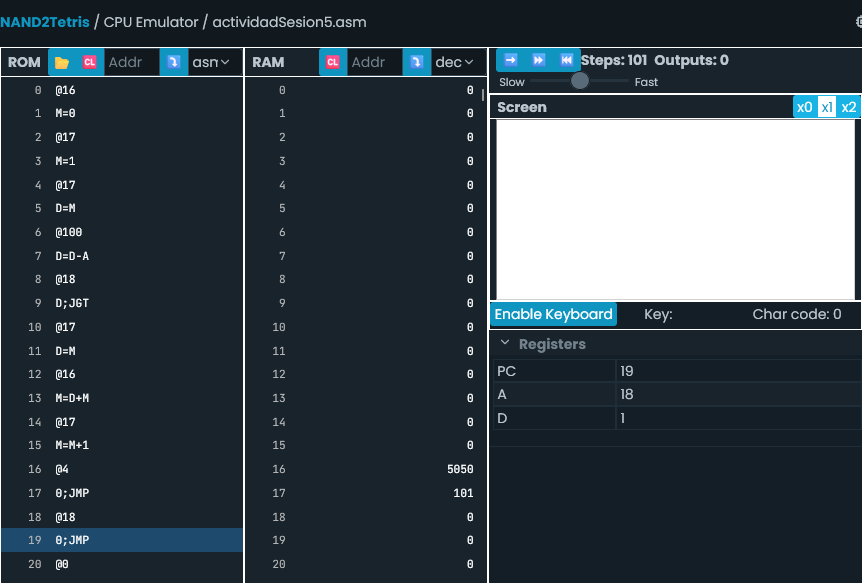

- Ambos programas son equivalentes debido a que la condición de loop es la misma y siguen el mismo procedimiento para llegar hasta i >= 100. La diferencia es que el ‘while' loop se hace bajo la condición definida hasta que sea falsa, mientras que el ‘for' loop se hace iterando bajo la función generadora.
- Ambos programas en Assembly son prácticamente los mismos porque los loops de los programas en C++ tanto en 'while' como 'for' realizan el mismo loop para i.

