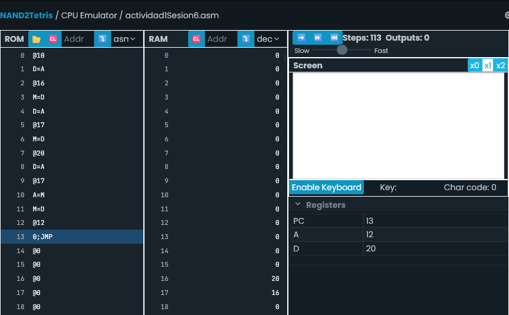
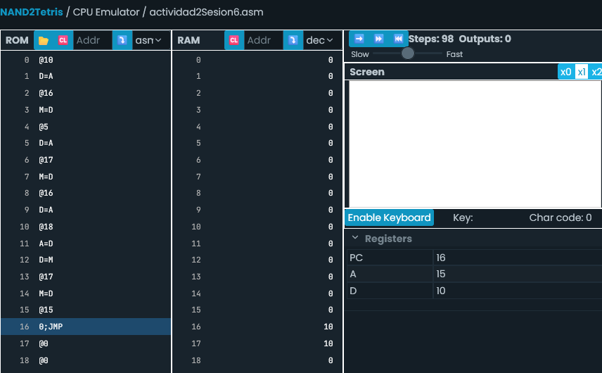
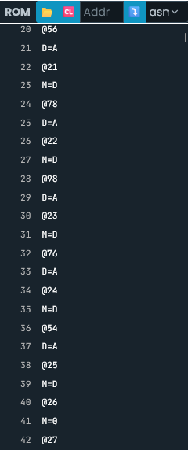
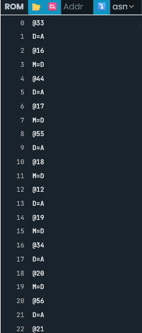
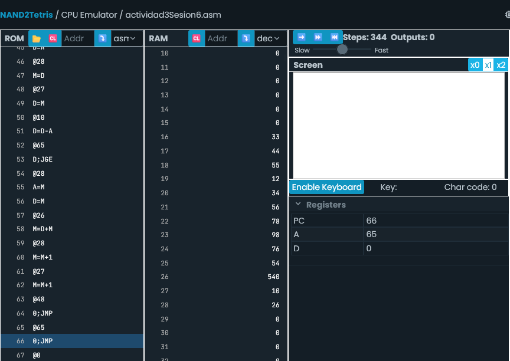

## PUNTERO
Variable que guarda una dirección de memoria.
    - El puntero apunta a la dirección de una variable cont
    - Puede modificar la variable
    - Puede manejar bloques de memoria
    
- ¿Cómo se **declara** un puntero en C++?

--> `int* p;`

- ¿Cómo se **define** (nota que antes preguntamos cómo se **declara**) un puntero en C++?

--> `p = &a;.`

- ¿Cómo se almacena en C++ la dirección de memoria de una variable? Con el operador **`&`**.

--> `p = &a;`

- ¿Cómo se escribe el contenido de la variable a la que apunta un puntero? Con el operador .

--> `p = 20;`
----------------------------------------------------------------------------------------------------------------
## Actividad 1

- Primer programa: Para que 'p' sea puntero de 'a', se le asigna al M de 'p' la dirección de memoria de 'a' para luego apuntarlo con A=M y asignarle el valor 20 guardado en D.

- Segundo programa: Se hace el mismo procedimiento para apuntar 'p' a la dirección de 'a', solo que al final se guarda el valor dentro de la memoria de 'a' mediante 'p' para asignárselo a 'b'.

## Actividad 2

- Este programa es largo, ya que hay que asignar todos los valores del arreglo en 10 espacios de memoria desde la dirección 16 hasta la 25. Después se definen las variables 'sum' que va guardando el resultado de la suma; 'j' que va guardando el contador del loop y 'ptr' que mantiene la dirección del elemento del arreglo actual cada vez que se itera el loop.

