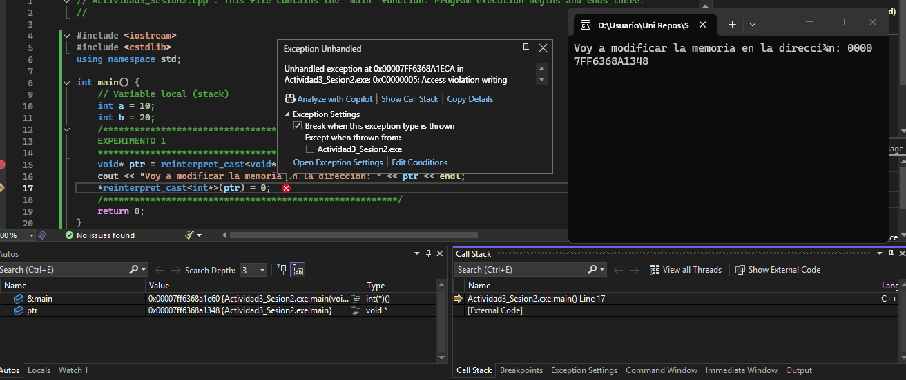
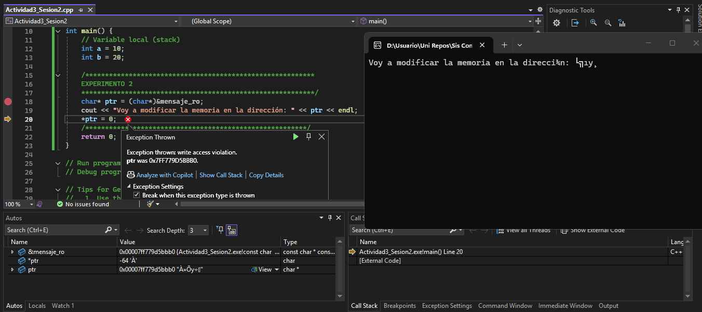
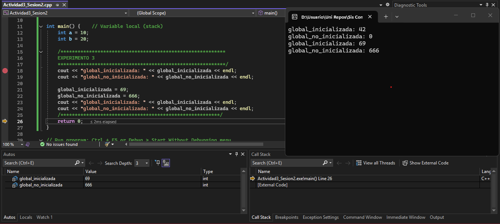
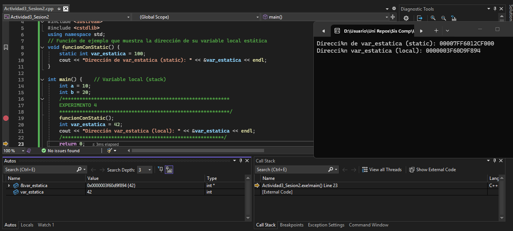
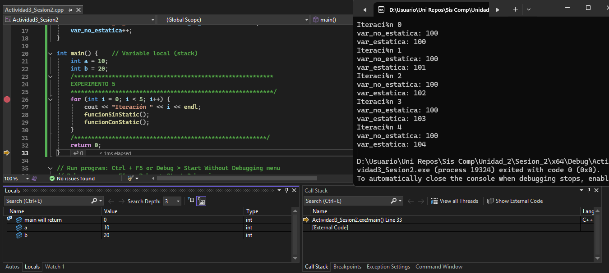
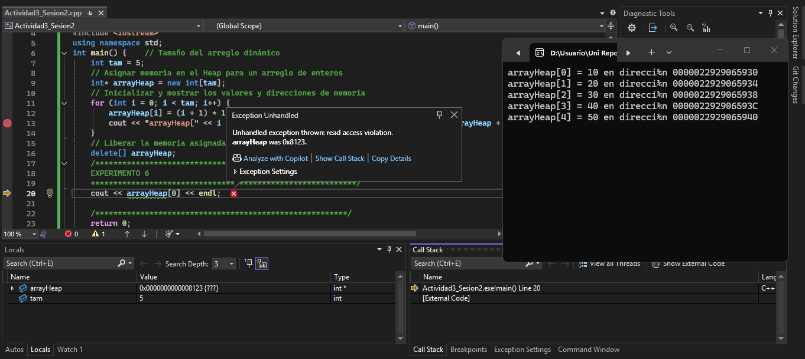
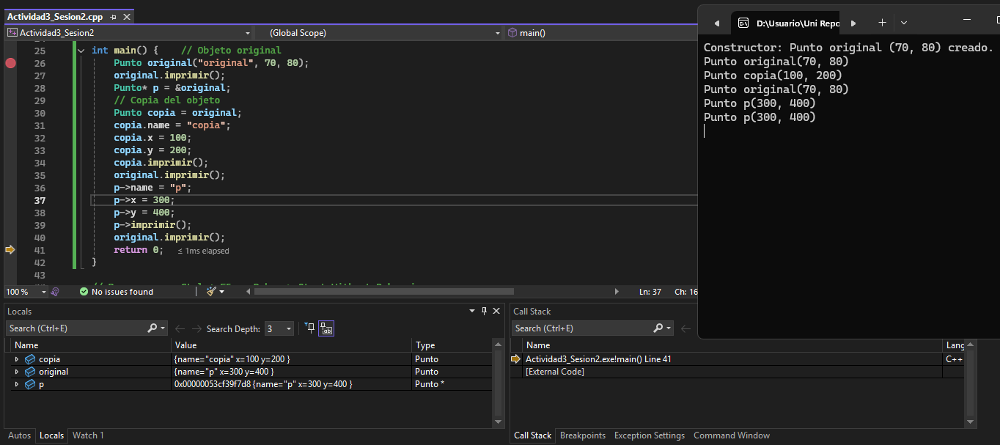
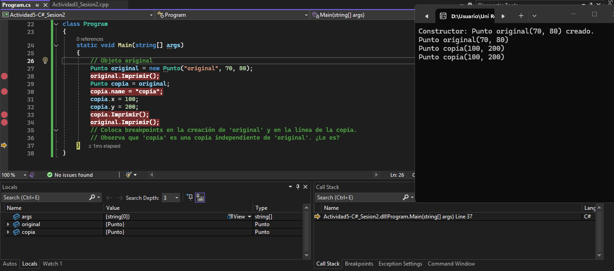

## Actividad 3: Mapa de memoria de un programa escrito en C++

### Segmento de Código

**.rodata: Solo Lectura**
- `const char* const mensaje_ro`

**.text: Funciones**
- `main()`
- `suma()`
- `funcionConStatic()`
- `crearArrayHeap()`

### Variables globales y estáticas

**.bss: Globales Sin Inicializar**
- `global_no_inicializada`

**.data: Globales y Estáticas Inicializadas**
- `global_inicializada`
- `var_estatica`

### Heap

- Array de 10 enteros creado con `new int[tam]` 

### Stack

- `a, b, c` en `main()`
- `a, b, c` (parámetro y variable local) en `suma()`
- `tamArray` en `main()`
- `arrayHeap` (puntero)
- `arr` en `crearArrayHeap()` (puntero local)
------------------------------------------------------------------------------------------------------------------------------------
## Actividad 4: EXPERIMENTOS

### Experimento 1

- Ocurre un error/excepción al intentar modificar el segmento de texto de `reinterpret_cast<void*>` ya que esa dirección está definida como solo de lectura (.text).

### Experimento 2

- Como 'mensaje_ro' se guarda como CONSTANTE, esta no se puede modificar después por la propiedad de las constantes que se guardan como variables de solo lectura.

### Experimento 3

- En este caso se inicializa la variable 'global_no_inicializada' pero no se le asigna valor, por lo que al intentar acceder a esta como no tiene valor automáticamente le asigna `0`. Luego dentro de `main()` a las dos variables globales se les cambia localmente su valor.

### Experimento 4

- Primero hay un error al intentar compilar ya que no se asigna 'int' a 'var_estatica' dentro de main().
- Al intentar acceder y cambiar el valor de `var_estatica`, como es estática en la memoria local se le asigna otro valor por lo que crea otra variable `var_estatica` local distinta de la global.

### Experimento 5

- El valor de `var_estatica` cambia, mientras que el de `var_no_estatica` no en cada interación.
- Como `var_estatica` guarda el valor almacenado en su variable por ser estática, esta va aumentando en 1 por cada iteración mientras que `var_no_estatica` como no tiene memoria del último valor almacenado se mantiene en el mismo en cada iteración.

### Experimento 6

- La consola muestra el valor de `arrayHeap[0]` a `arrayHeap[4]` incluyendo sus posiciones de memoria. Cuando se intenta imprimir `arrayHeap[0]` después de borrarlo se genera un error de intento de lectura a memoria ya que esta no está definida en el programa al borrar el arreglo.

#### Línea de error --> `cout << arrayHeap[0] << endl;`
- `Heap` va almacenando datos en ejecución de forma dinámica, mietras que `Stack` va almacenando la información de las subrutinas activas de un programa en ejecución y le asigna una dirección de memoria a cada una para luego ser referenciada después.
- Si no se libera cada instancia de una función no necesaria con `new` puede ocurrir un desbordamiento de la pila (stack overflow) si llega a haber una sobrecarga de datos en la memoria disponible.
- Es importante usar `delete[]` para liberar la memoria de un arreglo ya que después de haber accedido al contenido de los datos almacenados en este, se puede eliminar para dar disponibilidad a otra información pertinente en la memoria disponible y no aumentar el tamaño del programa innecesariamente. También puede ocurrir una **fuga de memoria** que sigue utilizando recursos del computador excesivamente.
------------------------------------------------------------------------------------------------------------------------------------
## Actividad 5: Copia de objetos y su ubicación en memoria
### Código en C++

### Código en C#

- **Copia en C++:** Se copia una instancia del objeto original en lugar de modificarlo. Este crea otro objeto en otra dirección de memoria y solo modifica el orignal cuando se referencia directamente a este con su punteto para modificar sus datos e imprimirlos. En este caso es *Independiente*.
- **Copia en C#:** Cuando se copia un objeto haciendo referencia a este, la copia modifica los datos del original y terminan teniendo ambos los valores definidos en la copia. En este caso *no es independiente*.