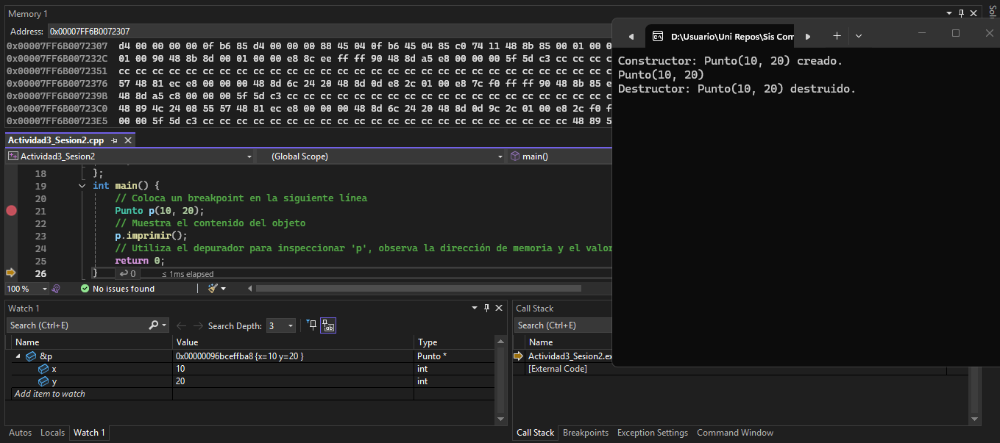
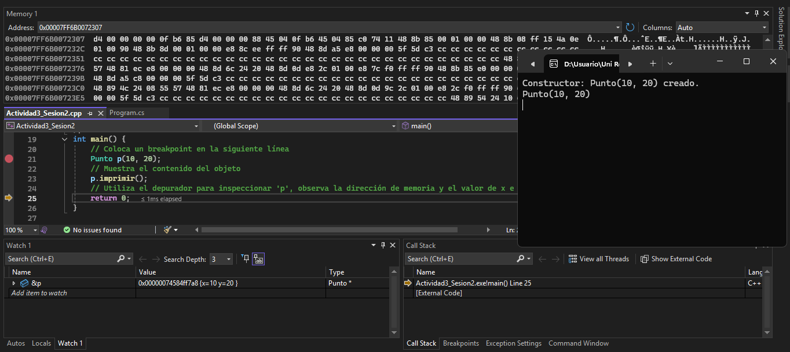

# Sesion 3
## Actividad 6: Creación de un objeto en el stack
### Código en C++

### Código en C#

- En **C++** uno puede controlar la creación de nuevas variables en el heap y la dirección de memoria en la que estas se almacenan, mientras que en **C#** uno no tiene ese control ya que se manejan de forma automática.

*Constructor C++:* Incializa atributos para ejecutar funciones y guardarlas en la memoria.
*Objeto C++:* Es una instanciación de una clase con atributos asignados.
*Clase C++:* Establece condiciones para la creación de funciones y objetos.

## Actividad 7: Objetos en el heap - creación y observación

1. *pStack:* Objeto creado (0x00000005a958f6d8).
2. *pHeap:* Referencia a objeto creado --> punto en dirección heap (0x0000011437595d40).
3. 
4. 