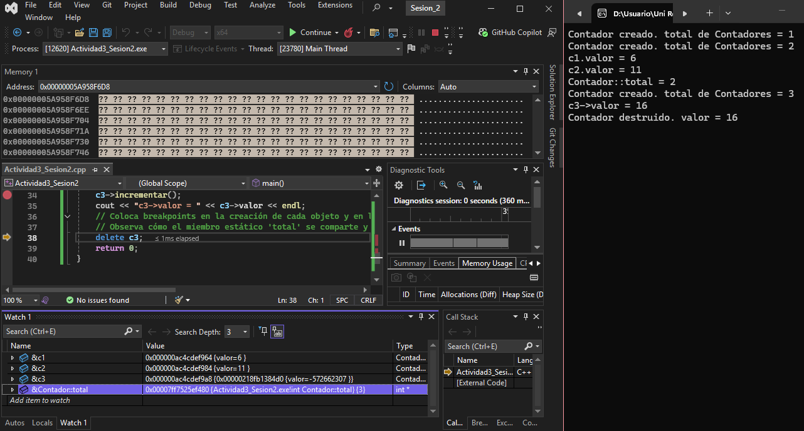
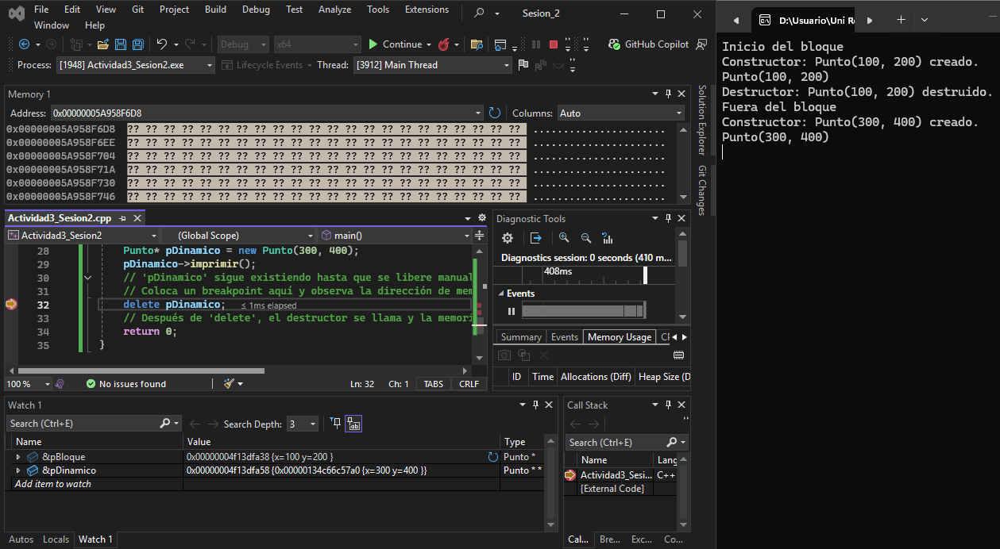
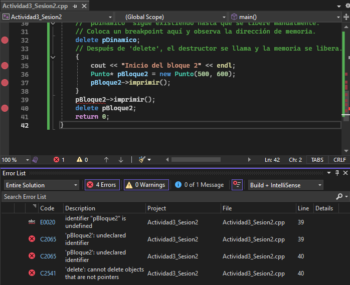

## Actividad 9: Objetos con miembros estáticos y variables de instancia

**Valor c1:** 6
**Valor c2:** 11
**Valor c3:** 16
**Total:** 3 --> cada vez que se crea una instancia va aumentando en 1 y guarda ese valor (estática)

- El miembro valor de la clase contador se almacena dentro de la sección de variables locales para cada instancia de objeto mientras que el miembro total se almacena en la sección `.data` y es la misma para todas las instancias.

1. Los miembros estáticos son útiles para asignar un mismo valor que va cambiando cada vez que se modifica en cada instancia de objeto. Si no es necesario que cada clase use un valor distinto para una variable y esta hace parte esencial para la descripción o funcionamiento de un objeto, es mejor hacerla **estática**.
2.  +		&c1	0x000000ac4cdef964 {valor=6 }	Contador *
    +		&c2	0x000000ac4cdef984 {valor=11 }	Contador *
    +		&c3	0x000000ac4cdef9a8 {0x00000218fb1384d0 {valor=-572662307 }}	Contador * * (puntero a otra dirección donde se almacena el valor)

## Actividad 10: Explorando el ciclo de vida de un objeto
### Actividad 10.1

1. Cuando se crea un objeto en el **stack**, mantiene el valor de una variable definida localmente temporalmente hasta que sale del bloque (conjunto de instrucciones). Cuando se crea un objeto en el **heap**, este se almacena en la memoria disponible de forma dinámica y se accede a este cuando se necesite, por lo que se debe llamar la función de delete para borrarlo de la memoria dentro de `main()`.
### Actividad 10.2

1. No, porque no está definido `pBloque2` cuando se intenta imprimir. Esto se debe a que se crea esta instancia de objeto local dentro de un conjunto de instrucciones, por lo que al salir de este se borra el objeto y luego no se puede llamar porque no existe.