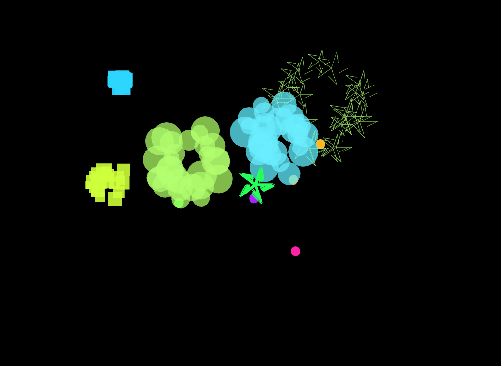
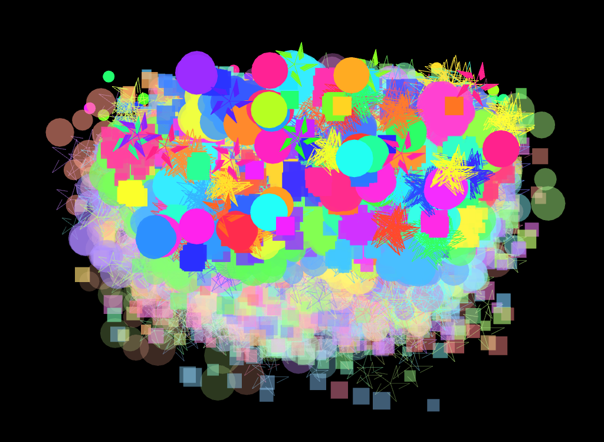
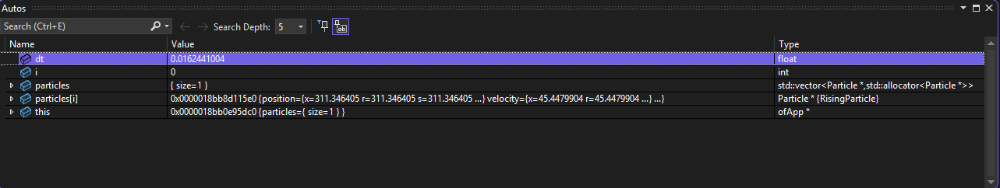
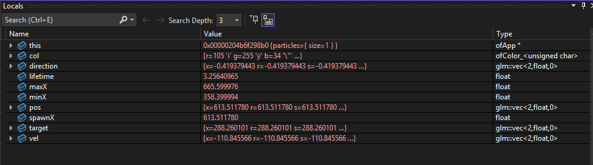
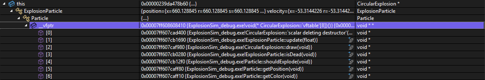
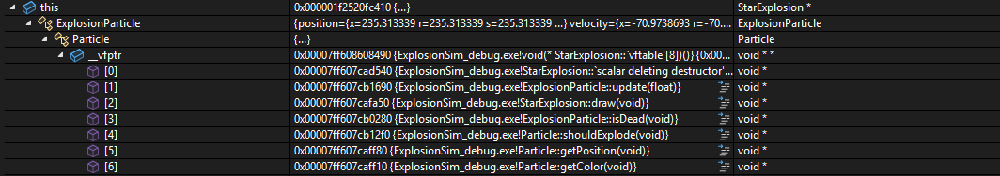
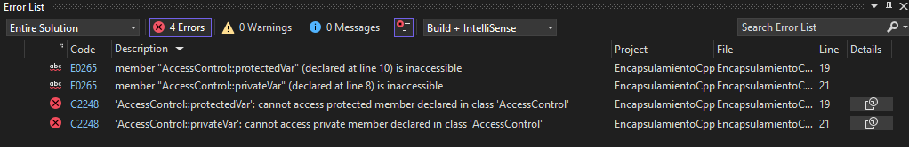
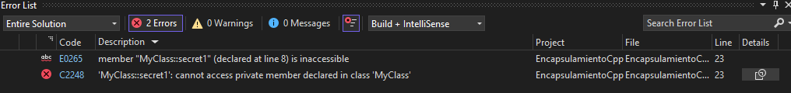
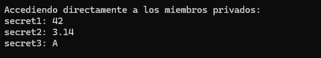

# Actividad 1

## Parte 1
1. **Encapsulamiento:** Permite almacenar una cantidad de datos que se operan dentro de una unidad, usualmente una clase, y luego se acceden a estos cuando es necesario sin tener que exponerlos a cambios innecesarios o modificaciones que alteren el valor de un método o atributo.

2. **Herencia:** Permite que una clase herede los atributos y métodos de otra clase padre. Los programadores usan herencias para estructuras jerárquicas de clases que comparten funcionalidades generales de una clase a otra, como definir una clase padre `Gato` y sus múltiples subclases para cada raza de `Gato`.

3. **Polimorfismo:** Permite que los objetos y métodos tomen diferentes propiedades de una clase y la moldeen de acuerdo a cómo se está accediendo a la clase que almacena los elementos base. Un código "polimórfico" es el que en lugar de crear una clase con métodos y atributos específicos para cada caso de uso, usa los de una base establecida donde puede acceder y utilizar estos para cualquier tarea que necesite usar las funcionalidades de esa clase.

## Parte 2

### Encapsulamiento
```
private string nombre;
    public string Nombre {
		    get { return nombre;}
		    protected set { nombre = value; }
		    }
```
- Es encapsulamiento porque al utilizar el atributo nombre con `get` y `set` para cada figura que la utilize, se está modificando una instancia del atributo nombre para esa clase sin alterar la original.
- Se evita que cualquier método fuera a acceder al atributo nombre de la clase base `Figura()`, si no que acceda a una instancia de esta que no altere los datos de la original.

### Herencia

- Es la clase hija de figura y hereda sus atributos, indicándolo con dos puntos (:) y utilizando los métodos de la clase figura para modificarlo de acuerdo a las propiedades de un círculo

```
public class Circulo : Figura{
		public double Radio { get; private set; }
    public Circulo(double radio) : base("Círculo")    {
		    this.Radio = radio;
		    }
    public override void Dibujar()    {
		    Console.WriteLine($"Dibujando un {Nombre} de radio {Radio}.");
		    }
		}
```

- Hereda el atributo 'nombre' y el método `Dibujar()` que lo usa haciéndole override para que ese método funcione específicamente para el círculo.

### Polimorfismo

- Cada objeto queda almacenado en un espacio de memoria distinto, por lo que al llamar al método `fig.Dibujar()` apunta a cada instancia de objeto en la lista y la imprime. Esto funciona aplicando polimorfismo al método con override para que la función `Dibujar()` funcione para cada tipo de figura distinto.

## **Parte 3**

1. Cuando se crea un rectángulo como en `misFiguras.Add(new Rectangulo(4.0, 6.0));` se está creando un objeto Rectangulo con base 4.0 y altura 6.0 que se almacena en la memoria *Heap* tomando estos datos del *Stack*, y pensaría que tanto nombre, base y altura de este rectángulo ocupan espacios de memoria seguidos uno de otro en el Heap.

2. Pienso que cada vez que ejecuta la función `fig.Dibujar()` dentro del loop, se da cuenta que cada objeto tiene un override a esa función para que cambie la ejecución de ese método de acuerdo a la figura llamada en la lista, y eso se puede hacer ya que en la clase `Figura()` se define como un método *abstract* para que se le pueda aplicar *polimorfismo* dentro de cada clase hija.

3. Creo que cuando el compilador corre el código, este no puede leer los atributos definidos como `private` dentro de una clase si no se indica un *encapsulamiento* que tome una copia de ese atributo para poder usarlo libremente, ya que un atributo privato solo puede ser accedido dentro de la clase que lo almacena si no se crea una instancia de este.

# Actividad 2

- Dentro del programa, cada vez que hago click izquierdo o derecho se crea una instancia de partícula con color, velocidad, dirección y explosión aleatorios definidos en `ofApp.h` cuando se llama al método `createRisingParticle()`



- Cuando presiono 's', la clase `keyPressed` toma una captura de la pantalla del programa con el método `ofSaveScreen(...)`

- Cuando presiono espacio, la clase `KeyPressed` llama a `createRisingParticle()` 1000 veces con el loop para crear 1000 partículas a la vez.



# Actividad 3

## Punto 1
**Antes:** Primero se asignan espacios de memoria para almacenar los datos de las funciones como segmentos de código. Luego, cada vez que se crea una partícula se asigna un espacio en el Stack a cada una que luego se elimina cuando termina de explotar.

**Después:**


Al crearse una partícula, primero se procesa de acuerdo a qué valores para cada parámetro le fueron asignados y les asigna una dirección de memoria. Luego a la párticula se le asigna otra dirección de memoria para su posición dentro de la lista partículas que se hayan creado desde el momento que se crea hasta cuando se destruye.

## Punto 2
- En la memoria, para crear una partícula de tipo circular, se deben heredar tanto los atributos de `explosion particle` y `particle` que tienen los atributos necesarios para crear esta partícula. Para cada uno se le asigna una posición de memoria en el stack, y al final se asigna el valor de esa partícula completa en el último valor de memoria reservado para la creación de esta partícula.



- Para cada atributo de partícula asignada a esta instancia de `ExplosionParticle` se le asigna una posición de memoria dentro de esta tabla virtual. Como están asignados como `void`, estos son guardados de forma temporal durante el período de vida de la partícula para luego ser eliminados cuando esta deje de estar presente en el programa.



- Ambas tablas usan la misma cantidad de espacios de memoria ya que comparten los mismos atributos como partículas particulares que heredan los atributos de la clase padre `Particle`. Ya varían son en los atributos locales específicos para el tipo de partícula que se está creando, como en el caso de `StarExplosion` que se le asignan valores de `innerRadius`, `outerRadius` y `rays`.

**Rpta/=** La tabla de funciones virtuales funciona para asignar valores únicos a cada instancia de objeto que se crea de una clase que no necesariamente se replican entre cada instancia. En este programa, como se crean aleatoriamente varias instancias de partículas con distintas formas y efectos, se crea una tabla de funciones virtuales para cada una donde se le asignan sus valores correspondientes a los atributos de cada partícula, para que cuando se creen en el programa, este sepa cómo debe mostrar cada partícula creada sin entrar en conflicto con el resto de partículas creadas.

# Actividad 4

## Punto 1


- Hay 2 errores de compilación en el código. Esto se debe a que se está intentando acceder a unas variables locales que no se pueden acceder desde fuera de la clase en la que se definió (protected, private). Solamente cuando las lineas estaban comentadas no había error ya que solamente se estaba accediendo a la vriable establecida como pública.

## Punto 2


- Hay un error de compilación, porque como indica el error se está intentando acceder a una variable establecida como privada dentro de la clase `MyClass`.



- En este caso si se pueden acceder a las variables privadas, porque se usa referencia por puntero a cada variable sin intentar acceder a cada una directamente porque el puntero solo toma el valor de esta sin alterar el estado de esta directamente. 

**Encapsulamiento:** Es una forma de protección de datos de valores que no queremos que sean accedidos libremente porque o son modificados raramente o el acceso a estos debe ser restringido para evitar la pérdida de datos o la vulneración de la información almacenada. Por lo tanto, el encapsulamiento permite acceder a los valores almacenados en las variables encapsuladas solamente cuando se necesitan, sin tener que alterar las variables originales.

# Actividad 5

- El depurador muestra de forma escalonada las herencia de la clase `CircularExplosion`, donde los valores de cada clase son asignados de acuerdo a los valores y métodos manejados en cada uno. Como `Particle` es heredado por `ExplosionParticle`, este se encuentra formando parte de `ExplosionParticle` y sus atributos son asignados a una sección de memoria dedicada a manejar la tabla de funciones virtuales para esta partícula. Como `ExplosionParticle` es heredado por `CircularExplosion`, se encuentra formando parte de este y sus atributos son almacenados en la parte `Static` de la memoria para ser usados por `CircularExplosion`.

- **Herencia en C++:** Para implementar herencia en C++, se utilizan clases base que funcionan como fundaciones que se utilizan repetidamente en otras clases que puedan heredar sus atributos porque hacen parte de estos y por lo tanto pueden heredar clases padres con herencia sin tener que implementar múltiples veces el mismo tipo de atributos para cada clase hija que pueda heredar de las bases. Una clase hereda de otra indicándola con dos puntos (:) señalando la clase de la que va a heredar, ejecutando primero los constructores de la clase padre y luego los de la hija. Cada cambio a un atributo heredado de una clase padre se maneja localmente sin alterar los de la base.

## Experimento Herencia Múltiple

```
#include <iostream>
using namespace std;

class Carro {
public:
    void conducir() {
        cout << "Conduciendo en carretera." << endl;
    }
};

class Bote {
public:
    void navegar() {
        cout << "Navegando en agua." << endl;
    }
};

class VehiculoDoble : public Carro, public Bote {
public:
    void usar() {
        conducir();
        navegar();
    }
};

int main() {
    VehiculoDoble miVehiculo;
    miVehiculo.usar();
    return 0;
}
```

# Actividad 6


# Actividad 7

1. ¿Cómo y por qué de la implementación de cada una de las extensiones solicitadas al caso de estudio?


2. ¿Cómo y por qué de la implementación de los conceptos de encapsulamiento, herencia y polimorfismo en tu código?


3. Explica cómo verificaste que cada una de las extensiones funciona correctamente, muestra capturas de pantalla del depurador donde evidencias lo anterior, en particular el polimorfismo en tiempo de ejecución.

