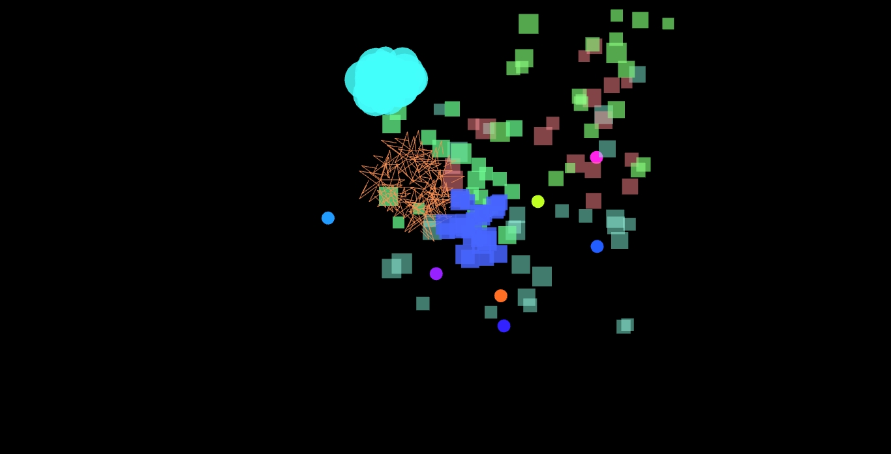
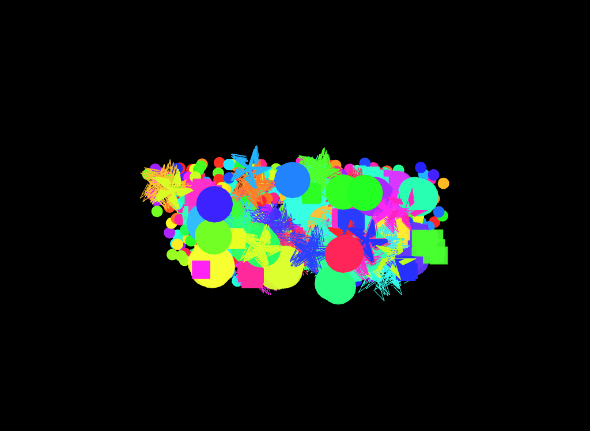
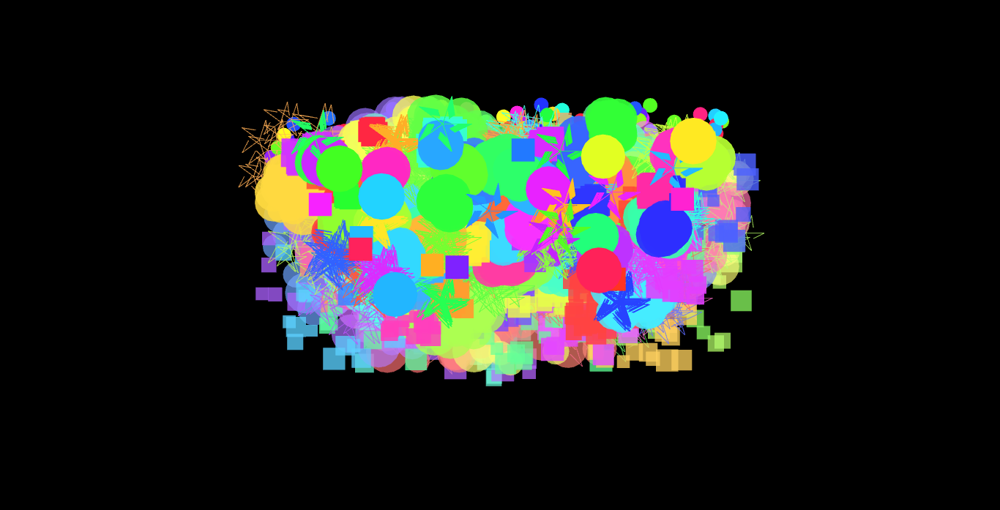

# Actividad 1

## Parte 1
1. **Encapsulamiento:** Permite almacenar una cantidad de datos que se operan dentro de una unidad, usualmente una clase, y luego se acceden a estos cuando es necesario sin tener que exponerlos a cambios innecesarios o modificaciones que alteren el valor de un método o atributo.

2. **Herencia:** Permite que una clase herede los atributos y métodos de otra clase padre. Los programadores usan herencias para estructuras jerárquicas de clases que comparten funcionalidades generales de una clase a otra, como definir una clase padre `Gato` y sus múltiples subclases para cada raza de `Gato`.

3. **Polimorfismo:** Permite que los objetos y métodos tomen diferentes propiedades de una clase y la moldeen de acuerdo a cómo se está accediendo a la clase que almacena los elementos base. Un código "polimórfico" es el que en lugar de crear una clase con métodos y atributos específicos para cada caso de uso, usa los de una base establecida donde puede acceder y utilizar estos para cualquier tarea que necesite usar las funcionalidades de esa clase.

## Parte 2

### Encapsulamiento
```
private string nombre;
    public string Nombre {
		    get { return nombre;}
		    protected set { nombre = value; }
		    }
```
- Es encapsulamiento porque al utilizar el atributo nombre con `get` y `set` para cada figura que la utilize, se está modificando una instancia del atributo nombre para esa clase sin alterar la original.
- Se evita que cualquier método fuera a acceder al atributo nombre de la clase base `Figura()`, si no que acceda a una instancia de esta que no altere los datos de la original.

### Herencia

- Es la clase hija de figura y hereda sus atributos, indicándolo con dos puntos (:) y utilizando los métodos de la clase figura para modificarlo de acuerdo a las propiedades de un círculo

```
public class Circulo : Figura{
		public double Radio { get; private set; }
    public Circulo(double radio) : base("Círculo")    {
		    this.Radio = radio;
		    }
    public override void Dibujar()    {
		    Console.WriteLine($"Dibujando un {Nombre} de radio {Radio}.");
		    }
		}
```

- Hereda el atributo 'nombre' y el método `Dibujar()` que lo usa haciéndole override para que ese método funcione específicamente para el círculo.

### Polimorfismo

- Cada objeto queda almacenado en un espacio de memoria distinto, por lo que al llamar al método `fig.Dibujar()` apunta a cada instancia de objeto en la lista y la imprime. Esto funciona aplicando polimorfismo al método con override para que la función `Dibujar()` funcione para cada tipo de figura distinto.

## **Parte 3**

1. Cuando se crea un rectángulo como en `misFiguras.Add(new Rectangulo(4.0, 6.0));` se está creando un objeto Rectangulo con base 4.0 y altura 6.0 que se almacena en la memoria *Heap* tomando estos datos del *Stack*, y pensaría que tanto nombre, base y altura de este rectángulo ocupan espacios de memoria seguidos uno de otro en el Heap.

2. Pienso que cada vez que ejecuta la función `fig.Dibujar()` dentro del loop, se da cuenta que cada objeto tiene un override a esa función para que cambie la ejecución de ese método de acuerdo a la figura llamada en la lista, y eso se puede hacer ya que en la clase `Figura()` se define como un método *abstract* para que se le pueda aplicar *polimorfismo* dentro de cada clase hija.

3. Creo que cuando el compilador corre el código, este no puede leer los atributos definidos como `private` dentro de una clase si no se indica un *encapsulamiento* que tome una copia de ese atributo para poder usarlo libremente, ya que un atributo privato solo puede ser accedido dentro de la clase que lo almacena si no se crea una instancia de este.

# Actividad 2

- Dentro del programa, cada vez que hago click izquierdo o derecho se crea una instancia de partícula con color, velocidad, dirección y explosión aleatorios definidos en `ofApp.h` cuando se llama al método `createRisingParticle()`



- Cuando presiono 's', la clase `keyPressed` toma una captura de la pantalla del programa con el método `ofSaveScreen(...)`

- Cuando presiono espacio, la clase `KeyPressed` llama a `createRisingParticle()` 1000 veces con el loop para crear 1000 partículas a la vez.

