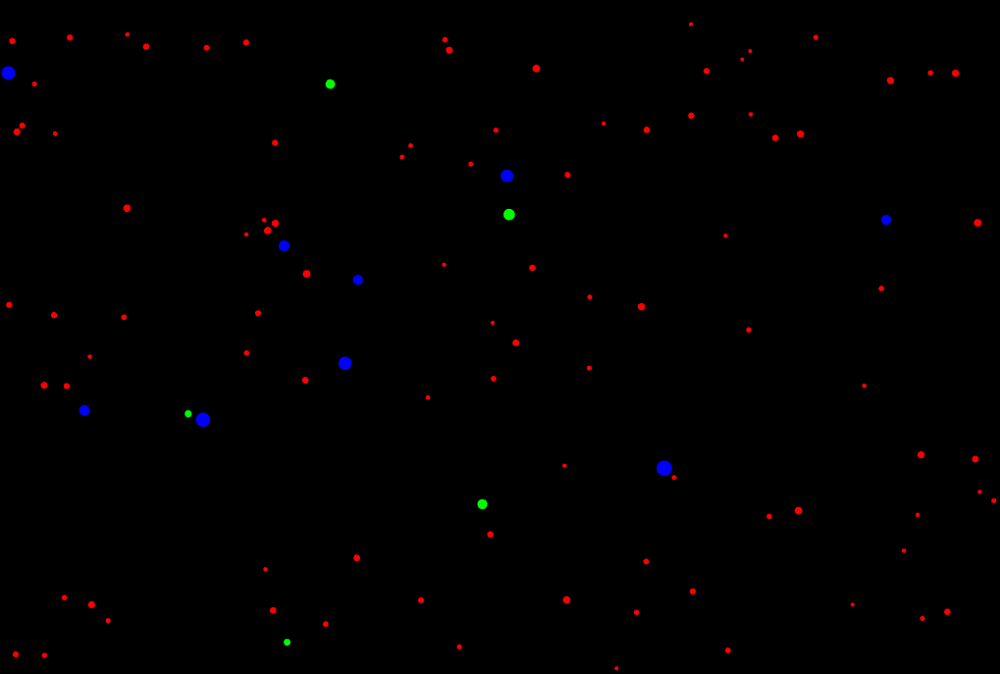
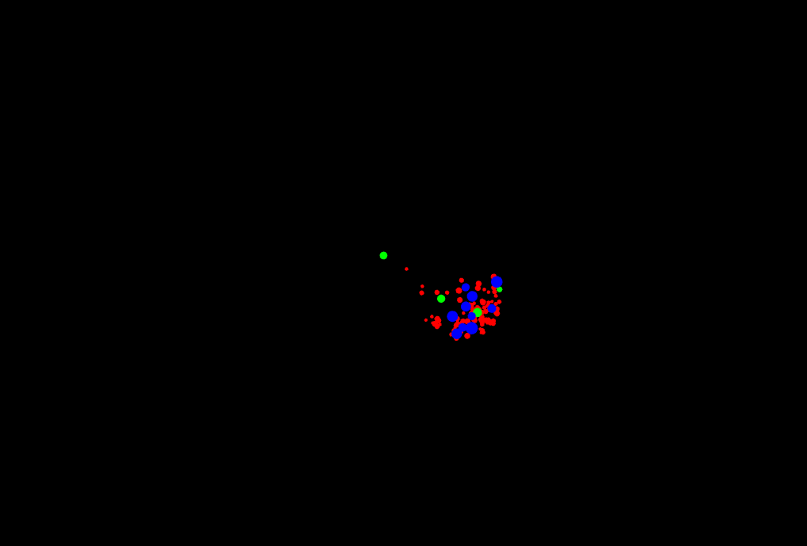
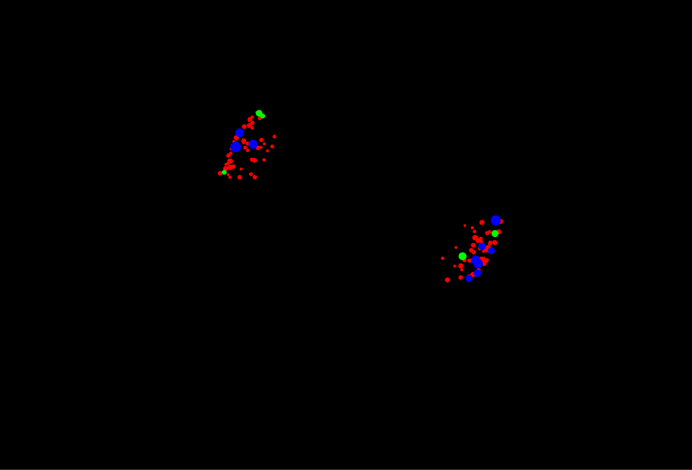
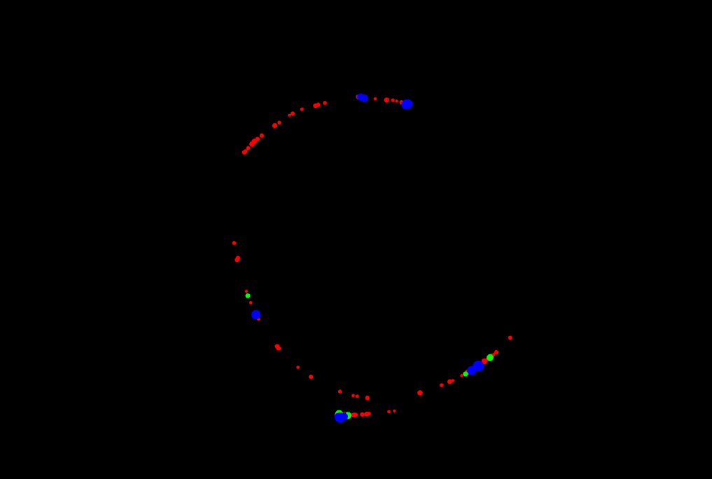
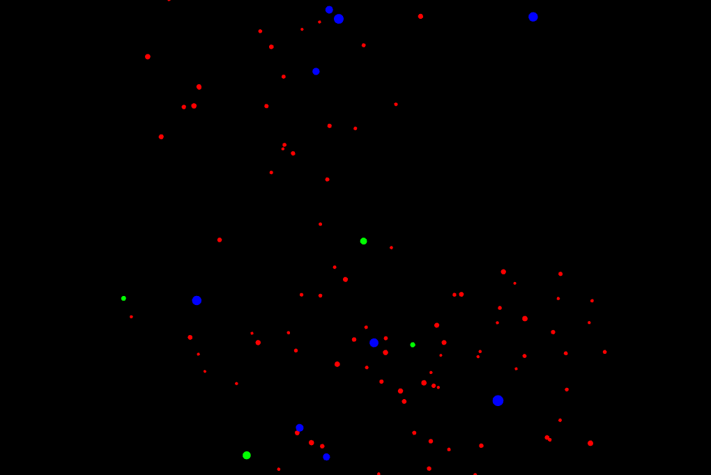

**https://refactoring.guru/design-patterns**
-------------------------------------------------------------------------
# Actividad 8

1. - *Tecla 'A':* Atrae las partículas a la posición del cursor.
- *Tecla 'S':* Detiene las partículas en su posición actual.
- *Tecla 'R':* Aleja las partículas de la posición del cursor.
- *Tecla 'N':* Regresa las patículas a su patrón de movimiento original.

2. Las partículas rojas y azules tienen un patrón de movimiento similar, siendo las azules más grandes y en menor cantidad que las rojas. Las partículas verdes tienen un tamaño un poco mayor a las rojas y en cantidad similar a las azules pero se mueven más rápido que las otras 2.

3. ## Estado Inicial

## Tecla 'A'

## Tecla 'R'

## Tecla 'S'

## Tecla 'N'

4. Al presionar cada tecla, asumo que el programa indica a cada partícula reasignar su patrón de movimiento actual al indicado por la tecla presionada, haciendo que detenga su patrón actual y haciendo switch al patrón de movimiento nuevo, y esto se aplica a cada partícula del programa.

# Actividad 9

1. El patrón **Observer** elimina la necesidad de que un objeto esté verificando durante toda la duración del programa el estado del polling constantemente para verificar su estado actual. Solo cuando el **Subject** realiza las llamadas correspondientes para realizar cambios a su estado es cuando el objeto (observer) lo hace.

2. 